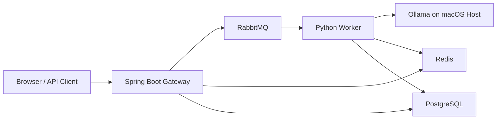

<div align="center">

# InfraQ

**A MacBook-first local inference engine for running, queueing, and benchmarking LLM workloads on macOS.**

<p>
  
  
  
  
  
</p>

</div>

InfraQ is a lightweight inference gateway designed for **MacBook-based local LLM serving**. It keeps the model runtime on the **host machine** so Ollama can use **Apple Metal acceleration**, while the gateway, worker, Redis, RabbitMQ, and PostgreSQL run in containers.

The project is built around one practical goal: **compare inference scheduling strategies under a realistic queued workload** without standing up a large distributed serving stack.

## Why InfraQ

- **MacBook-first**: Ollama runs natively on macOS instead of inside Docker, which is the right tradeoff for Apple GPU access.
- **Asynchronous by default**: requests are accepted immediately, queued through RabbitMQ, and processed by a worker.
- **Fast + durable state**: Redis serves low-latency status polling; PostgreSQL keeps a durable record of requests and benchmark runs.
- **Benchmark-oriented**: includes multiple scheduling modes inspired by vLLM and SGLang for side-by-side comparison.
- **Built-in dashboard**: ships with a browser UI for submission, metrics, and benchmark visualization.

## Architecture



## Core Features

### Inference flow

- `POST /api/v1/infer` accepts a prompt and returns a request ID immediately.
- The worker pulls jobs from RabbitMQ and calls Ollama on the host machine.
- Results are written to Redis for quick polling and PostgreSQL for persistence.

### Scheduling strategies

InfraQ currently includes four worker modes:

| Strategy | What it does | Best use |
| --- | --- | --- |
| `sequential` | One request at a time | Baseline / control |
| `static` | Collect a fixed batch, process together, then wait for all to finish | Simple batching experiments |
| `continuous` | Keep a fixed number of active slots and refill immediately | Throughput-oriented testing |
| `cached` | Continuous scheduling plus prompt-cache short-circuiting | Repeated-prompt workloads |

### Dashboard

The web UI includes:

- **Submit**: send prompts and poll for completion
- **Results**: inspect recent requests and outputs
- **Benchmark**: run fixed prompt-set benchmarks and visualize latency breakdowns
- **Metrics**: see queue depth, completions, cache hits, and active config

## Tech Stack

| Layer | Technology |
| --- | --- |
| Gateway | Spring Boot 3, Java 17 |
| Worker | Python 3.11, `aio-pika`, `aiohttp` |
| Model runtime | Ollama on macOS host |
| Queue | RabbitMQ |
| Cache / fast state | Redis |
| Durable storage | PostgreSQL |
| UI | Static HTML/CSS/JS + Chart.js |

## Quick Start

### 1. Prerequisites

- A **MacBook running macOS**
- **Docker Desktop for Mac**
- **Ollama** installed on the host
- A model pulled locally, for example:

```bash
ollama pull qwen2.5:1.5b
```

If Ollama is not already running:

```bash
ollama serve
```

### 2. Start the stack

From the project root:

```bash
docker compose up --build
```

Then open:

- Dashboard: `http://localhost:8081`
- RabbitMQ UI: `http://localhost:15673`
- PostgreSQL: `localhost:5433`
- Redis: `localhost:6380`

### 3. Submit a request

```bash
curl -X POST http://localhost:8081/api/v1/infer \
  -H "Content-Type: application/json" \
  -d '{
    "prompt": "Explain what a load balancer does in two sentences.",
    "taskType": "chat",
    "priority": 0
  }'
```

Example response:

```json
{
  "id": "2d2c3b2f-5c8d-4f53-9e77-b51cc5c5036d",
  "status": "QUEUED"
}
```

Check status:

```bash
curl http://localhost:8081/api/v1/infer/<REQUEST_ID>
```

## Running Benchmarks

Start a benchmark:

```bash
curl -X POST http://localhost:8081/api/v1/benchmark \
  -H "Content-Type: application/json" \
  -d '{
    "numRequests": 20,
    "strategy": "continuous",
    "numSlots": 4
  }'
```

Fetch benchmark results:

```bash
curl http://localhost:8081/api/v1/benchmark/<BENCHMARK_ID>
```

The benchmark workload uses a fixed prompt set with intentional duplicates so you can observe the impact of prompt caching.

> Note
> The worker reads strategy and slot settings on startup. In the current implementation, changing benchmark/runtime config is **not a true live hot-swap** unless the worker is restarted with the new settings.

## Configuration

Most runtime configuration is handled through environment variables in [`docker-compose.yml`](./docker-compose.yml).

Important values:

| Variable | Default | Purpose |
| --- | --- | --- |
| `OLLAMA_HOST` | `http://host.docker.internal:11434` | Reach Ollama running on the host Mac |
| `MODEL` | `qwen2.5:1.5b` | Model used by the worker |
| `NUM_CONCURRENT_SLOTS` | `4` | Worker concurrency level |
| `SCHEDULING_STRATEGY` | `continuous` | Worker scheduling mode |
| `ACP_POSTGRES` | `jdbc:postgresql://postgres:5432/infraq` | Gateway database URL |

## Development

### Gateway

```bash
cd gateway
./mvnw test
./mvnw spring-boot:run
```

### Worker

```bash
cd worker
python3 -m venv .venv
source .venv/bin/activate
pip install -r requirements.txt
python3 worker.py
```

## API Surface

| Method | Endpoint | Description |
| --- | --- | --- |
| `POST` | `/api/v1/infer` | Submit an inference request |
| `GET` | `/api/v1/infer/{id}` | Fetch status / result |
| `GET` | `/api/v1/infer/list` | List recent requests |
| `POST` | `/api/v1/benchmark` | Start a benchmark run |
| `GET` | `/api/v1/benchmark/{id}` | Fetch benchmark results |
| `GET` | `/api/v1/benchmark` | List benchmark history |
| `GET` | `/api/v1/metrics` | Read live counters and queue depth |
| `PUT` | `/api/v1/metrics/config` | Update runtime config stored in Redis |

## Repository Layout

```text
.
├── gateway/          # Spring Boot API + dashboard
├── worker/           # Python async worker that talks to Ollama
├── docker-compose.yml
└── init-db.sql       # PostgreSQL schema
```

## Current Limitations

InfraQ is a strong local prototype, but it is not a production serving stack yet.

- Worker strategy changes are **not truly hot-swapped**; the current worker reads strategy/slot settings when it starts.
- There is **no authentication, multi-tenant isolation, or rate limiting**.
- The system uses **single-worker local orchestration**, not distributed scheduling across multiple hosts.
- Ollama inference is **non-streaming** in the current implementation.
- Default database and broker credentials are for **local development only**.

## Validation

The current repository has been minimally validated with:

- `cd gateway && ./mvnw test`
- `cd worker && python3 -m py_compile worker.py`
- `docker compose config -q`

## License

Add a license file before publishing publicly.
